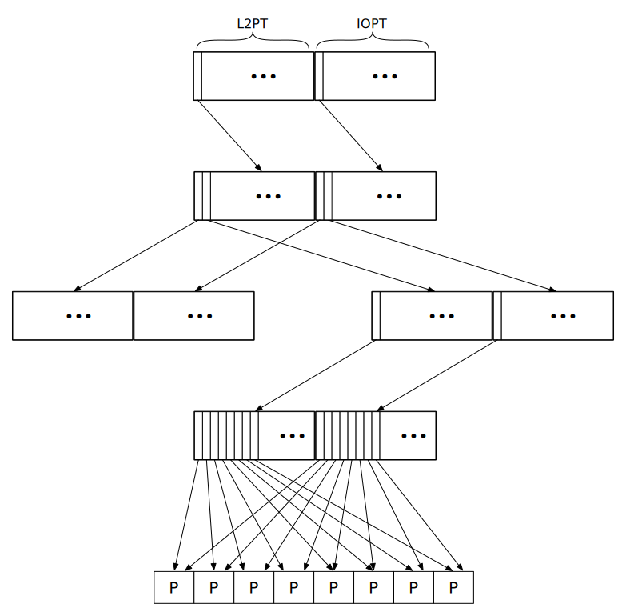

:state: Needed
:date: 2023-01-07
:labels: design

Use of Virtual Memory in Hypatia
================================

Hypatia, like most systems, makes extensive use of virtual
memory for both its internal organization as well as security
and isolation.

This document describes the address spaces the hypervisor
maintains and how the virtual memory hardware is used.

The Hypervisor Address Space
----------------------------

The hypervisor reserves the upper half of the virtual address
for its own use.  This area is used to map segments and tasks.

The lower half the address space is reserved for mapping virtual
machine memory, with guest physical addresses in bijection with
host virtual addresses in this portion of the address space.
Note, however, that we do not usually map guest memory in the
host unless we need to access it for some specific reason.
These mappings are generally private to a task.

Recursive Page Tables
---------------------

In the host, Hypatia uses _recursive page tables_ to describe
and manipulate the virtual address space.

Hypatia requires running on a system where the structure of page
tables and their entries are architecturally defined, and where
the paging structures form a radix tree so that a path from the
root to a leaf entry is defined by indices taken from a mapped
virtual address, and where any given entry at any level in the
radix tree can pun for an entry at a different level.  Given a
system meeting these requirements, _recursive page tables_
employ a technique where a single entry in radix tree root table
(in Hypatia, the last entry) points back to the root itself:

With this table organization, the paging hardware can be
exploited to access any entry in the paging radix tree for any
mapped virtual address by deriving another virtual address for
the desired entry from the original address.  By accessing that
address, the MMU _recurses_ through the root table.

How Recursive Page Tables Work
~~~~~~~~~~~~~~~~~~~~~~~~~~~~~~

Consider a system that uses 4 level page tables.  Let us call a
table at the root of the paging radix tree a PML4, and we call
the root level L4.  Tables at the next lower level of the tree
are called PML3s, and so on with PML2, and PML1 at the leaf
level.  Similarly the levels are referred to as L3, L2, and L1
at the leaves.  Pictorially:

When the MMU does a page table walk to translate a virtual
address to a physical address, it starts at the root of the
radix tree, and looks up the next level by using an offset
computed from the virtual address and current level.  This
process repeats until the MMU encounters an unmapped entry, an
entry with the Large or Huge bit set, or it has completely
descended the tree to a leaf entry.

With the recursive entry at in the root table, we can trick the
MMU into cutting the lookup short by recursing through the root
table one or more times: the more times we recurse through the
root, the more levels we remove from MMU's walk.  Thus, we can
access any element in the paging radix tree defining a mapping
for a given virtual address _va_ by deriving a second virtual
address, _va'_, that forces recursion through the root one or
more times.

In this manner, we can look up any entry in the page table
structures, simply by constructing an address for the entry in
the recursively mapped portion of the address space.

Advantages of Recursive Page Tables
~~~~~~~~~~~~~~~~~~~~~~~~~~~~~~~~~~~

Recursive page tables have several advantages:

. The location of the physical pages in the paging structure
  need not share any particular relationship with the virtual
  address space.  That is, we do not need a strictly-defined map
  from virtual to physical in order to access the paging
  structures themselves.
. Given a contiguous region of virtual address space R, bounded
  by the half-open interval between virtual addresses 'b' and
  'e', all entries for the structures mapping this region at
  any given level in the tree are adjacent in the virtual
  address space, as if they were in an array bounded by the
  entries for _a_ and _e_.

This latter point deserves elaboration.  Consider a 4 level page
table mapping a 1TiB region aligned on 256 MiB boundaries, using
4KiB pages.  This requires 3 PML4 entries, 1024 PML3 entries,
524288 PML2 entries, and 268435456 PML1 entries.  However, for
each kind of entry, the entries covering the region will be
adjacent in the recursive part of the address space, regardless
of where they fall in the physical address space.  We may access
them as if they were an array.  This allows us to perform
operations on contiguous portions of the address space without
the expense of walks from the root; for example, we could
accumulate dirty or accessed bits for the entire region via a
linear scan of the leaf entry array.  By contrast, for example
in a direct mapped scheme, these will likely be scattered around
the virtual address space and accesses to those entries would
require a fair amount of pointer chasing.

Disadvantages of Recursive Page Tables
~~~~~~~~~~~~~~~~~~~~~~~~~~~~~~~~~~~~~~

Recursive page tables are not absent disadvantages:

. They occupy some portion of the virtual address space, which
  becomes unavailable to the hypervisor for other use.  In
  practice, this is relatively small (1/512th of the total
  space, or 1/256th of the space dedicated to the hypervisor).
. They work best with architecturally-defined page tables
  consumed directly by hardware, and are a poor fit for systems
  with e.g. soft TLBs.  In that sense, they are somewhat less
  portable than other schemes.
. Using the MMU to look up paging structures places some
  additional pressure on the TLB beyond that required for the
  normal operation of the system.
. Data in Large and Huge pages appears in the recursive
  mapping area, which may inadvertently leak real information
  e.g. into the cache for speculation-based attacks.  We must be
  careful to use the smallest available page size in the host,
  to prevent this from happening.

This last point is a potentially serious limitation: using small
pages for everything is expensive.  However, since we are a
hypervisor and not a general-purpose operating system, the cost
is amortized.

Virtual Machine Address Spaces
------------------------------

Hypatia is designed to run on machines that support a
second-level page table (L2PT) in hardware, such as an EPT
(Extended Page Table) on Intel processors with VMX support, or
an NPT (Nested Page Table) on AMD processors that support SVM
extensions.  This structure describes the guest physical address
space in terms of mapping into the host physical address space.

We also presume the existence of an IOMMU that participates in
the hardware virtualization scheme, allowing us to safely pass
some IO devices directly through to the guest, e.g., using
SR-IOV or as part of a trusted virtual machine.  These use their
own page tables defined by the IOMMU: we call this the IO page
table, or IOPT.

Thus, we have some three page tables that we have to manipulate
as part of running a virtual machine:

. The portion of the host virtual address space dedicated to
  the guest, canonically the lower half of that address space
  and described by the host page tables,
. The guest physical address space, described by the L2PT, and
. The guest physical address space as seen by hardware devices
  assigned to the virtual machine, described by the IOPT

Guest physical memory is not mapped into the host virtual
address space while a VCPU is running.  In contrast, the guest
physical address space must be fully described in the L2PT in
order for the guest to run normally without undue overhead, and
the similarly for the IOPT, as many devices cannot handle IO
page faults.

Recursive Access to L2 and IO Page Tables
-----------------------------------------

We would like to use the same recursive technique we use for the
host virtual address space to both access and manipulate the L2
and IO page tables, but there are several reasons we cannot.

First, the L2PT and IOPT do not necessarily use the same page
table format as the host.  For example the Intel EPT used with
VMX uses the Itanium page table format.  The host MMU would not
be able to understand, and so would not walk, the EPT format
directly.

Secondly, even if the table format were not an issue, we may not
want to use a recursive self-link on such a table, because we
would not be able to hide that from a guest.

Finally, we very often want to use huge and large pages into the
EPT for performance reasons.  To see why this may be a problem,
suppose that the table format were not an issue.  Then the
astute reader may notice that we could simply use another entry
in the host PML4 to point to the EPT; we could recurse through
the host PML4 as many times as needed, and then follow the EPT
entries.  However, recall that a disadvantage of recursive
tables is that data from huge and large pages shows up in
the recursive area: setting the large or huge page bit in a page
table entry in a PML3 or PML2 (respectively) causes the MMU to
terminate its walk early.  For such a pages in the recursive
area, the first 2MiB contents of a 1 GiB huge page show up as a
large page, and the first 4KiB of a 2MiB large page show up as
an ordinary page.  This is potentially a security issue.

But, something that we can do that avoids all of these problems
and allows us to treat the L2 and IO page tables as if they were
recursive is to dedicate a region of virtual memory for them and
then simply map the paging structures in that region at the same
addresses they would appear at _if they were recursive_.  This
may seem terribly inefficient, but it's not: because we are
mapping the paging structures, and not pages themselves, a
single 4KiB table at the leaf maps up to 1GiB of memory; as a
percentage of total memory mapped, the overhead of this scheme
is insignificant.  But because all of these paging structures
are mapped at addresses derived from the virtual address space
they map, we still have all of the advantageous properties we
use in the host address space.  Furthermore, since we map these
structures as data in the host, and since the MMU does not walk
them, we can safely use large and huge pages in the L2 and IO
tables without fear of leaking data in the recursive portion of
the address space as we do in the host.

Maintaining Virtual Machine Address Spaces
------------------------------------------

As mentioned above, there are three address spaces we must
maintain for any given VCPU task:

. The host virtual address space
. The guest physical address space defined by the L2PT
. The IO virtual address space defined by the IOPT

We use the above techniques for all three.  For the host address
space, we use the recursive techniques described above and the
MMU to access and manipulate virtual mappings.  For the L2PT and
IOPT, we map the paging structures in these tables in dedicated
portions of the host virtual address space, as described above.

When a virtual machine is created, we allocate it's entire RAM
complement and map that into the guest physical address space
using 4KiB pages.  We may then recombine these into large and
huge pages for efficiency, but by constructing the mapping using
4KiB pages, we ensure that we have sufficient memory
pre-allocated for splintering without requiring runtime memory
allocation, which is explicitly forbidden in Hypatia.  We do
similarly for the IO page tables required by the IOMMU.

We do not generally map guest memory into the host virtual
address space, though we may occasionally need to do so in order
to perform some operation on the guest's behalf (e.g., perform
IO).  For this, we keep a set of spare pages in every VCPU task
that we can temporarily allocate to paging structures, allowing
us to make temporary mappings as required.  Guest memory is then
identity mapped into the host, privately to each VCPU task, at
the guest's physical address.  These mappings are removed before
returning to the guest.

To prevent external fragmentation when creating VMs, we allocate
the L2 and IO page table structures together as a pair of
physically contiguous frames.  These are then mapped into the L2
and IO page table regions as above.  Pictorially:

Note that the L2 and IO page tables are shared between all VCPUs
and the VM control task in a virtual machine.

Splintering and Combining Pages in a Guest Address Space
--------------------------------------------------------

Often, we will want to splinter a Large or Huge page into a
smaller page size.  We can do this very cheaply in Hypatia due
to the way the addresses spaces are defined and accessed.  We
use the following algorithm:

Given a valid guest physical address _gpa_ that identifies a
1GiB physical frame of memory that we wish to splinter into 4KiB
pages, we:

. Look up the address of the corresponding L2 table
  corresponding to _gpa_ in the L2PT portion of the host
  recursive mapping.  This gives us the host physical address of
  the L2 page.
. Construct an L3 entry that points to the L2 page.
. Write that into the L2 entry corresponding to _gpa_ in the
  guest structure mapping area.

To recombine this region into a huge page, we follow a similar
algorithm:

. Look up the right-most L1 leaf corresponding to _gpa_ in the
  host recursive mapping, to retrieve the physical address of
  the extent.
. Construct an L2 entry pointing to that 1 GiB page frame with
  the "Huge" bit set.
. Write that entry into L2 entry corresponding to _gpa_.

Memory Sharing and Side-loaded Page Tables
------------------------------------------

The recursive technique can be used as a basis for sharing
memory between address spaces in the host.  Since all host
virtual address spaces employ the recursive technique, we can
use the MMU to access another address space's tables: we simply
allocate another entry in the root page table and point it at
the other address space's root: this allows us to use the MMU to
walk the other space's mappings in the same way we walk our own.

This technique is used to establish the task-set shared memory
region that is shared among tasks in a set.
